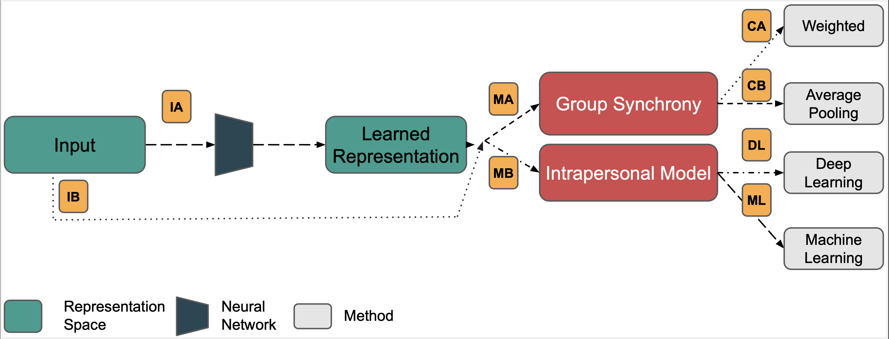

# WGS_Public
A Group Synchrony Approach for Emotion Recognition Using Physiological Signals

## Motivation

Humans are inherently social beings, spending significant time in collective activities at work, for leisure, or at home. In these settings, emotions are often influenced by the group and its members. While group emotion recognition using audiovisual sources is well-studied, the use of unobtrusive physiological signals for recognizing emotions within group interactions remains underexplored.

**Physiological synchrony**—the spontaneous and unintended alignment of physiological and behavioral responses among individuals in group scenarios—is a phenomenon documented in the literature on collective emotions. However, there is a gap in leveraging this synchrony for emotion recognition within group dynamics.

## Methods

This project addresses this gap by proposing a novel methodology that utilizes physiological synchrony to enhance emotion recognition. We introduce a **Weighted Group Synchrony (WGS) metric**, which performs a weighted average of the group members' emotion class labels to predict the label of an unknown subject. The weights are determined by the physiological synchrony between the unknown subject and each group member.

Throughout this work, we explore the following research questions:

- **RQ1:** What synchronization metrics and data representations are most suitable for measuring physiological synchrony for emotion recognition?
- **RQ2:** Does incorporating group-level information improve the accuracy of emotion classification?

To answer these questions, we developed the WGS metric and evaluated it against traditional machine learning and intrapersonal methods. Our analysis covers over eight data representations and eight synchronization metrics, comparing **Interpersonal vs. Intrapersonal** synchrony, and **WGS: Weighted vs. Average Pooling** approaches.

For detailed methodology and technical specifications, refer to the scientific paper available [here](https://ieeexplore.ieee.org/document/10097567).

  

  
  
  

## Results

- **RQ1:** HRV and EDA features using Euclidean distance proved most effective for measuring physiological synchrony in emotion recognition.
- **RQ1:** Metrics like Pearson, Spearman, and Cosine similarity showed reduced performance in morphology space.
- **RQ2:** The WGS approach outperformed both intrapersonal and average pooling methods in recognizing arousal and valence, achieving an M-F1 score of approximately 72.15% for arousal and 81.16% for valence on the AMIGOS dataset.

## Acknowledgments

This work was supported in part by **FCT - Fundação para a Ciência e a Tecnologia** under Grant 2020.06675.BD, the FCT/MCTES through national funds, and when applicable, co-funded by EU funds under Grants UIDB/50008/2020 and PCIF/SSO/0163/2019 “SafeFire,” and by **IT - Instituto de Telecomunicações**.
